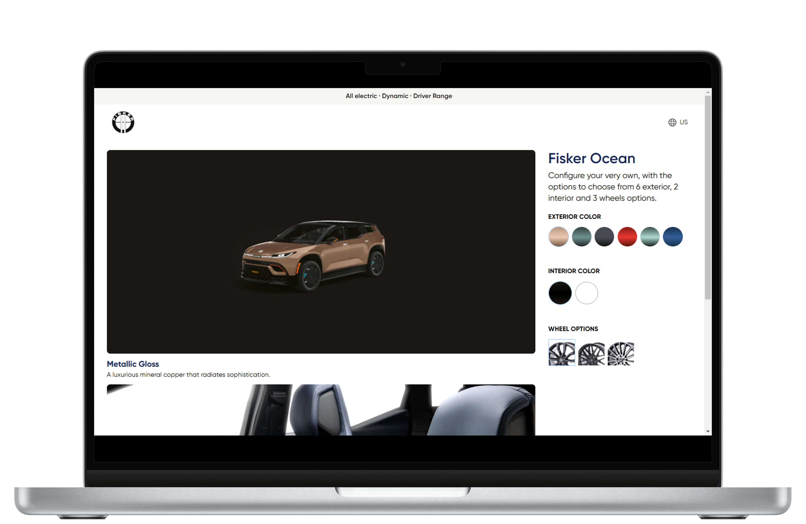

## 🚗 Car Configurator Project - Fisker Ocean

Welcome to the Fisker Ocean Car Configurator! This project allows users to customize and configure their ideal Fisker Ocean electric vehicle. Built with Next.js, React, and Tailwind CSS, it provides a seamless and responsive user experience.

## ✨ Features
- **🎨 Interactive Car Customization**: Users can select car models, colors, wheel types, and other customizable features.
- **📊 Dynamic Visualization**: Real-time updates as users change configurations.
- **📱 Responsive Design**: Works seamlessly on both desktop and mobile devices.
- **⚡ High Performance**: Optimized using Next.js for fast rendering.

## 🛠️ Technologies Used
- **⚛️ Next.js**: Framework for server-rendered React applications.
- **⚛️ React.js**: Component-based UI library for dynamic interfaces.
- **🎨 Tailwind CSS**: Utility-first CSS framework for styling.

### Final Configured Car

## 🚢 Deployment

### 🌐 Vercel
This project is optimized for deployment on Vercel:
1. Push your repository to GitHub.
2. Go to [Vercel](https://vercel.com/) and import your project.
3. Follow the setup instructions and deploy.

## 💡 Acknowledgments
- Special thanks to Fisker for the inspiration.
- [📘 Next.js Documentation](https://nextjs.org/docs)
- [📘 React Documentation](https://reactjs.org/docs/getting-started.html)
- [📘 Tailwind CSS Documentation](https://tailwindcss.com/docs)

